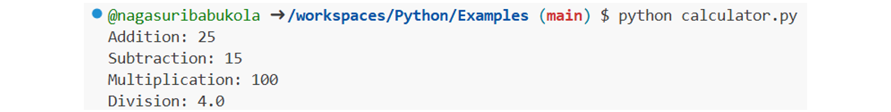
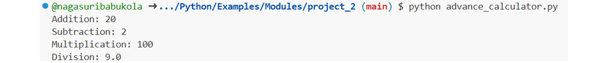
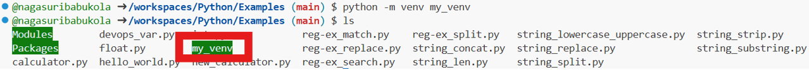
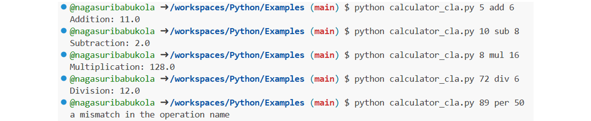

# Shell Scripting vs Python
* Certainly! The choice between using Shell Scripting and Python in DevOps depends on the specific task or problem you're trying to solve. Both have their strengths and are suitable for different scenarios. Here are some guidelines to help you decide when to use each:

## When Use Shell Scripting:
* **System Administration Tasks:** Shell scripting is excellent for automating routine system administration tasks like managing files, directories, and processes. You can use shell scripts for tasks like starting/stopping services, managing users, and basic file manipulation.
* **Command Line Interactions:** If your task primarily involves running command line tools and utilities, shell scripting can be more efficient. It's easy to call and control these utilities from a shell script.
* **Rapid Prototyping:** If you need to quickly prototype a solution or perform one-off tasks, shell scripting is usually faster to write and execute. It's great for ad-hoc tasks.
* **Text Processing:** Shell scripting is well-suited for tasks that involve text manipulation, such as parsing log files, searching and replacing text, or extracting data from text-based sources.
* **Environment Variables and Configuration:** Shell scripts are useful for managing environment variables and configuring your system.

## When Use Python:
* **Complex Logic:** Python is a full-fledged programming language and is well-suited for tasks that involve complex logic, data structures, and algorithms. If your task requires extensive data manipulation, Python can be a more powerful choice.
* **Cross-Platform Compatibility:** Python is more platform-independent than shell scripting, making it a better choice for tasks that need to run on different operating systems.
* **API Integration:** Python has extensive libraries and modules for interacting with APIs, databases, and web services. If your task involves working with APIs, Python may be a better choice.
* **Reusable Code:** If you plan to reuse your code or build larger applications, Python's structure and modularity make it easier to manage and maintain.
* **Error Handling:** Python provides better error handling and debugging capabilities, which can be valuable in DevOps where reliability is crucial.
* **Advanced Data Processing:** If your task involves advanced data processing, data analysis, or machine learning, Python's rich ecosystem of libraries (e.g., Pandas, NumPy, SciPy) makes it a more suitable choice.


# Python
## Installing Python
* [Refer Here](https://www.python.org/downloads/) for Official site
* In Official site, go to `Downloads` and choose `OS`
* Download required Version and Install it (Choose Windows)
* After installation check version `py --version`
  

## GitHub Workspace for Python
* Go to GitHub Repo, click `Code --> Codespaces` and click `Add(+)`
* A Codespaces Workspace is Opened
* In that, Python is already installed and check Version `python --version`

## Run Sample Project
* Write a Sample Python Project to print Hello World
  * Create a file with `.py` extension
  * Add the following code to the file:
    ```python
    print("Hello, World!")
    ```
  * Run the Python file using the command, use `py <filename>` for Windows and `python <filename>` for remaining
  
  


# Data Types
* In programming, a data type is a classification or categorization that specifies which type of value a variable can hold.
* Data types are essential because they determine how data is stored in memory and what operations can be performed on that data.
* Python, like many programming languages, supports several built-in data types. Here are some of the common data types in Python:
  * **Numeric Data Types:**
    * **int:** Represents integers (whole numbers). Example: `x = 5`
    * **float:** Represents floating-point numbers (numbers with decimal points). Example: `y = 3.14`
    * **complex:** Represents complex numbers. Example: `z = 2 + 3j`
  * **Sequence Types:**
    * **str:** Represents strings (sequences of characters). Example: `text = "Hello, World"`
    * **list:** Represents lists (ordered, mutable sequences). Example: `my_list = [1, 2, 3]`
    * **tuple:** Represents tuples (ordered, immutable sequences). Example: `my_tuple = (1, 2, 3)`
  * **Mapping Type:**
    * **dict:** Represents dictionaries (key-value pairs). Example: `my_dict = {'name': 'John', 'age': 30}`
  * **Set Types:**
    * **set:** Represents sets (unordered collections of unique elements). Example: `my_set = {1, 2, 3}`
    * **frozenset:** Represents immutable sets. Example: `my_frozenset = frozenset([1, 2, 3])`
  * **Boolean Type:**
    * **bool:** Represents Boolean values (`True` or `False`). Example: `is_valid = True`
  * **Binary Types:**
    * **bytes:** Represents immutable sequences of bytes. Example: `data = b'Hello'`
    * **bytearray:** Represents mutable sequences of bytes. Example: `data = bytearray(b'Hello')`
  * **None Type:**
    * **NoneType:** Represents the `None` object, which is used to indicate the absence of a value or a null value.
  * **Custom Data Types:**
    * You can also define your custom data types using classes and objects.

## Strings
1. **String Data Type in Python:**
   * In Python, a string is a sequence of characters, enclosed within single (' '), double (" "), or triple (''' ''' or """ """) quotes.
   * Strings are immutable, meaning you cannot change the characters within a string directly. Instead, you create new strings.
   * You can access individual characters in a string using indexing, e.g., `my_string[0]` will give you the first character.
   * Strings support various built-in methods, such as `len()`, `upper()`, `lower()`, `strip()`, `replace()`, and more, for manipulation.
2. **String Manipulation and Formatting:**
   * **Concatenation:** You can combine strings using the `+` operator.
   * **Substrings:** Use slicing to extract portions of a string, e.g., `my_string[2:5]` will extract characters from the 2nd to the 4th position.
   * **String interpolation:** Python supports various ways to format strings, including f-strings (f"...{variable}..."), %-formatting ("%s %d" % ("string", 42)), and `str.format()`.
   * **Escape sequences:** Special characters like newline (\n), tab (\t), and others are represented using escape sequences.
   * **String methods:** Python provides many built-in methods for string manipulation, such as `split()`, `join()`, and `startswith()`.

## Numeric Data Type
1. **Numeric Data Types in Python (int, float):**
   * Python supports two primary numeric data types: **int** for integers and **float** for floating-point numbers.
   * Integers are whole numbers, and floats can represent both whole and fractional numbers.
   * You can perform arithmetic operations on these types, including addition, subtraction, multiplication, division, and more.
   * Be aware of potential issues with floating-point precision, which can lead to small inaccuracies in calculations.
   * Python also provides built-in functions for mathematical operations, such as `abs()`, `round()`, and `math` module for advanced functions.

## Regex
1. **Regular Expressions for Text Processing:**
    * Regular expressions (regex or regexp) are a powerful tool for pattern matching and text processing.
    * The `re` module in Python is used for working with regular expressions.
    * Common metacharacters: `.` (any character), `*` (zero or more), `+` (one or more), `?` (zero or one), `[]` (character class), `|` (OR), `^` (start of a line), `$` (end of a line), etc.
    * Examples of regex usage: matching emails, phone numbers, or extracting data from text.
    * `re` module functions include `re.match()`, `re.search()`, `re.findall()`, and `re.sub()` for pattern matching and replacement.
    * Common Use Cases of `re` Module:
      * **Search:** Check if a pattern exists in a string.
      * **Match:** Check if a pattern matches at the start or in the entire string.
      * **Split:** Break a string into substrings based on a delimiter or pattern.
      * **Substitute:** Replace parts of a string with other text based on a pattern.

## Examples
* **String_Concatenation:**
    ```python
    value1 = "Hello"
    value2 = "World!"

    result = value1 + " " + value2
    print(result)
    ```
  * String Concatenation refers to combining two or more strings into one string. This is typically done using the `+` operator.
  
* **String_Length:**
    ```python
    text = "Python is High level programming language"
    length = len(text)
    print("Length of the String:", length)
    ```
  * This function returns the number of characters in the string, including spaces, punctuation, and special characters.
  
* **String_Lower & Upper Cases:**
    ```python
    text = "Python is Dynamic Programming language"
    
    lowercase = text.lower()
    uppercase = text.upper()

    print("LowerCase:", lowercase)
    print("UpperCase:", uppercase)
    ```
  * Easily convert a string to lowercase or uppercase using the built-in string methods l`ower()` and `upper()`, respectively
  
* **String_Replace:**
    ```python
    text = "Python is Awesome"
    new_text = text.replace("Awesome", "Great")
    print("Modified Text:", new_text)
    ```
  * Is used to replace a specified substring with another substring within a string. It returns a new string with the replacements made and does not modify the original string.
  
* **String_Split:**
    ```python
    text = "Python is Dynamic Programming language"
    words = text.split()
    print("Words:", words)
    ```
  * Is used to divide a string into a list of substrings based on a specified delimiter. By default, it splits the string at whitespace characters (spaces, tabs, newlines).
  
* **String_Strip:**
    ```python
    text = "    This text has an extra spaces    "
    stripped_text = text.strip()
    print("Stripped Text:", stripped_text)
    ```
  * Is used to remove leading and trailing whitespace (or other specified characters) from a string. It does not modify the original string but returns a new string with the removed characters.
  
* **String_Substring:**
    ```python
    text = "Python is Dynamic Programming language"
    substring = "is"

    if substring in text:
      print(substring, "found in the text")
    else:
      print(substring, "not found in the text")
    ```
  * The code is checking whether a specific smaller string (substring) is present within a larger string (text).
  
* **Int:**
    ```python
    #Integer Variables
    num1 = 10
    num2 = 5

    #Integer Division
    result_1 = num1 // num2
    print("Integer Division:", result_1)

    #Modulus (Remainder)
    result_2 = num1 % num2
    print("Modulus (Remainder):", result_2)

    #Absolute Value
    result_3 = abs(-7)
    print("Absolute Value:", result_3)
    ```
  * **Integer Division (//):** The `//` operator performs integer division, which divides the two numbers and discards the remainder, returning only the quotient as an integer.
  * **Modulus (Remainder) (%):** The `%` operator calculates the remainder of the division of one number by another.
  * **Absolute Value (abs()):** The `abs()` function returns the absolute value of a number, which is the non-negative version of the number.
  
* **Float:**
    ```python
    #Float Variables
    num1 = 6.0
    num2 = 2.5

    #Basic Arithmetic
    result_1 = num1 + num2
    print("Addition:", result_1)

    result_2 = num1 - num2
    print("Subtraction:", result_2)

    result_3 = num1 * num2
    print("Multiplication:", result_3)

    result_4 = num1 / num2
    print("Division:", result_4)

    #Rounding
    result_5 = round(5.2194578232, 2) #Rounds to 2 decimal places
    print("Rounded:", result_5)
    ```
  * **Basic Arithmetic Operations:** Addition (`+`), Subtraction (`-`), Multiplication (`*`) & Division (`/`)
  * **Rounding (round()):** The `round()` function rounds a number to a specified number of decimal places. Here, `5.2194578232` is rounded to 2 decimal places.
  
* **Regex (The Regular Expression Module):**
  * **Search:**
      ```python
      import re

      text = "I am learning Python for DevOps"
      pattern = r"Python"

      search = re.search(pattern, text)

      if search:
        print("Pattern Found:", search.group())   #Prints the matched text
        print("Start Position:", search.start())  #Start index of the match
        print("End Position:", search.end())      #End index of the match
      else:
        print("Pattern not Found")
      ```
    * `re.search()` is used to Scans the entire string to **find the pattern anywhere**.
    * In Pattern, The `r` before the string denotes a `raw string`, ensuring special characters (like `\`) are treated literally.
  
  * **Match:**
      ```python
      import re

      text = "I am learning Python for DevOps"
      pattern = r"Python"

      match = re.match(pattern, text)

      if match:
        print("Match Found=", match.group())
      else:
        print("Match not Found")
      ```
    * `re.match()` is used to Checks for a **match only at the beginning of the string**.
  
  * **Replace:**
      ```python
      import re

      text = "I am learning Python for DevOps"
      pattern = r"DevOps"

      replacement = "Company Requirement"

      new_text = re.sub(pattern, replacement, text)
      print("Modified Text:", new_text)
      ```
    * `re.sub()` is used to **search for a pattern in a string and replace it with a new value**.
  
  * **Split:**
      ```python
      import re

      text = "Git,Jenkins,Terraform,Docker,Kubernetes,Python"
      pattern = r","

      split_result = re.split(pattern, text)
      print("Split Result:", split_result)
      ```
    * `re.split()` is used to **split a string based on a specific pattern** (in this case, a comma `,`).
  


# Keywords in Python
* Keywords are reserved words in Python that have predefined meanings and cannot be used as variable names or identifiers.
* These words are used to define the structure and logic of the program.
* They are an integral part of the Python language and are case-sensitive, which means you must use them exactly as specified.
* Here are some important Python keywords:
  * **and:** A logical operator that returns `True` only if `both conditions are True`.
  * **or:** A logical operator that returns `True` if `at least one condition is True`.
  * **not:** A logical operator that flips the condition. If `it’s True, it becomes False`, and vice versa.
  * **if:** Starts a conditional block. `If` the condition is `True`, `the code inside runs`.
  * **else:** `Runs a block of code` if the `if` condition is `False`.
  * **elif:** Short for "else if," it is used to check additional conditions after an `if` statement and is used in combination with `if` and `else`.
  * **while:** It is used to create a loop that `repeatedly executes a block of code` as long as a `specified condition is true`.
  * **for:** It is used to create a loop that iterates over a sequence (such as a list, tuple, or string) and `executes a block of code for each item in the sequence`.
  * **in:** Used with `if`, it checks if a value is present in a sequence.
  * **try:** It is the beginning of a block of code that is subject to exception handling. It is followed by `except` to catch and handle exceptions.
  * **except:** Used with `try`, it defines a block of code to execute when an exception is raised in the corresponding `try` block.
  * **finally:** Used with `try`, it defines a block of code that is always executed, whether an exception is raised or not.
  * **def:** It is used to `define a function` in Python.
  * **return:** It is used within a function to `specify the value that the function should return`.
  * **class:** It is used to define a class, which is a blueprint for creating objects in object-oriented programming.
  * **import:** It is used to `import modules` or libraries to access their functions, classes, or variables.
  * **from:** Used with `import` to specify which specific components from a module should be imported.
  * **as:** Used with `import` to create an alias for a module, making it easier to reference in the code.
  * **True:** It represents a boolean value for `true`.
  * **False:** It represents a boolean value for `false`.
  * **None:** It represents a special `null value` or `absence of value`.
  * **is:** It is used for identity comparison, checking if two variables refer to the same object in memory.
  * **lambda:** It is used to create small, anonymous functions (lambda functions).
  * **with:** It is used for context management, ensuring that certain operations are performed before and after a block of code.
  * **global:** It is used to declare a global variable within a function's scope.
  * **nonlocal:** It is used to declare a variable as nonlocal, which allows modifying a variable in an enclosing (but non-global) scope.


# Understanding Variables in Python
* In Python, a variable is a named storage location used to store data.
* Variables are essential for programming as they allow us to work with data, manipulate it, and make our code more flexible and reusable.
* **Example:**
    ```python
    #Assigning a Value to a Variable
    my_variable = 24

    #Accessing the Value of a Variable
    print(my_variable)
    ```
  * When you print the Variable, it prints the value assigned to that Variable.
  

## Variable Scope and Lifetime:
* **Variable Scope:** In Python, Variables have different Scopes, which determine where in the code the Variable can be accessed. There are mainly two types of Variable Scopes:
  1. **Local Scope:** Variables defined within a function have local scope and are only accessible inside that function.
      ```python
      def my_function():
        s = 22    #Local Variable
        print(s)
      
      my_function()
      print(s)
      ```
       * The Variable `s` is a Local Variable because it is defined inside the `my_function`. When you print the Variable `s` directly, it raises an error because the Variable `s` is not defined outside the function.
  
  1. **Global Scope:** Variables defined outside of any function have global scope and can be accessed throughout the entire code.
      ```python
      k = 44    #Global Variable

      def my_function():
        print(k)
      
      my_function()
      print(k)
      ```
       * The Variable `k` is a Global Variable because it is not defined inside any function. When you print `k` inside `my_function` and outside of function, in both cases it prints the Variable Value because global variables are accessible throughout the entire program.
  
* **Variable Lifetime:**
  * The Lifetime of a Variable is determined by when it is created and when it is destroyed or goes out of scope.
  * Local variables exist only while the function is being executed, while global variables exist for the entire duration of the program.

## Variable Naming Conventions and Best Practices
* It's important to follow naming conventions and best practices for Variables to write clean and maintainable code:
  * Variable Names should be Descriptive and indicate their Purpose.
  * Use Lowercase Letters and separate words with Underscores `_` (snake_case) for Variable Names.
  * Avoid using Reserved Words `(Keywords)` for Variable Names.
  * Choose Meaningful Names for Variables.
* **Example:**
    ```python
    #Good Variable Naming
    user_name = "Suresh"
    total_items = 22

    #Avoid using of Reserved Words
    class = "Python"  #Not Recommended

    #Use Meaningful Names
    s = 10                #Less Clear
    num_of_students = 10  #More Descriptive
    ```

## Explanation of Variable Updates
* In Python, when you assign a value to a variable, it overwrites the previous value stored in that variable.
* After updating a variable, any further use of that variable will refer to the updated value, not the original one.
* **No Conflicts:** There are no conflicts because Python allows variables to be re-assigned at any point in your code. The last assigned value is what the variable holds.
* **Example:**
    ```python
    port = 80
    print(f"Port: {port}")

    port = 443
    print(f"Updated Port: {port}")
    ```
  
  * **First Assignment:**
    * When `port = 80` is defined, the variable `port` stores the value `80`.
    * The first `print(f"Port: {port}")` fetches the current value of `port` (which is `80`) and prints it.
  * **Re-assignment:**
    * When `port = 443` is executed, Python replaces the previous value of `port` with the new value (`443`).
    * Now, any further reference to `port` will use the updated value (`443`).
  * **No Conflicts:**
    * Python works in a linear, top-to-bottom manner.
    * When a variable is updated, it simply stores the new value, and the old value is no longer relevant.

# Exercises
* **Example:** Using Variables to Store and Manipulate Configuration Data in a DevOps Context
  * In a DevOps context, you often need to manage configuration data for various services or environments.
  * Variables are essential for this purpose.
  * Let's consider a scenario where we need to store and manipulate configuration data for a web server.
    ```python
    #Define Configuration Variables for a Wed Server
    server_name = "My_Nginx_Server"
    port = 80
    is_https_enabled = False
    max_connections = 500

    #Print the Configuration
    print(f"Server Name: {server_name}")
    print(f"Port: {port}")
    print(f"HTTPs Enabled: {is_https_enabled}")
    print(f"Max Connections: {max_connections}")

    #Update Configuration Values
    port = 443
    is_https_enabled = True

    #Print the Updated Configuration
    print(f"Updated Port: {port}")
    print(f"HTTPs Enabled: {is_https_enabled}")
    ```
    * In this example, we use variables to store and manipulate configuration data for a web server.
    * This allows us to easily update and manage the server's configuration in a DevOps context.
  


# Some Important Points
## Formatted Strings (f)
* The `f` in `print(f"...")` is used to create **f-strings** (short for **formatted strings**) in Python.
* F-strings are a way to embed expressions inside string literals, using curly braces `{}`.
* They make it easy to include variable values or expressions directly within a string.
* The formate is `print(f"Name: {Var_Name}")`
* **Example:**
    ```python
    port = 80
    print(f"Port: {port}")
    ```


# Python Functions, Modules and Packages
## Python Functions
* A function in Python is a block of code that performs a specific task.
* Functions are defined using the `def` keyword and can take inputs, called arguments.
* They are a way to encapsulate and reuse code.
* Function takes the Inputs, perform required Logics and finally returns Output.
* **Example:**
    ```python
    #Define Function
    def greet(name):
        return f"Hello, {name}!"
    
    #Call the Function
    message = greet("Suresh")
    print(message)
    ```
  * In this example, `greet` is a function that takes a `name` argument and returns a greeting message.
  
### Python Functions Exercises
* **Example:1** Write Program for Calculator using Functions
    ```python
    num1 = 20
    num2 = 5

    def addition():
        add = num1 + num2
        print("Addition:", add)
    
    def subtraction():
        sub = num1 - num2
        print("Subtraction:", sub)
    
    def multiplication():
        mul = num1 * num2
        print("Multiplication:", mul)
    
    def division():
        div = num1 / num2
        print("Division:", div)
    
    addition()
    subtraction()
    multiplication()
    division()
    ```
  * In above example, we need to call functions explicitly, which means at the end we need to provide the function name `<Function_Name>()`
  * In the above example, we have hard-coded the values.
  
* **Example:2** Write Program for Calculator using Functions with `return` Keyword
    ```python
    def addition(num1, num2):
        add = num1 + num2
        return add
    
    def subtraction(num1, num2):
        sub = num1 - num2
        return sub
    
    def multiplication(num1, num2):
        mul = num1 * num2
        return mul
    
    def division(num1, num2):
        div = num1 / num2
        return div
    
    print("Addition:", addition(20, 5))
    print("Subtraction:", subtraction(10, 5))
    print("Multiplication:", multiplication(5, 15))
    print("Division:", division(50, 5))
    ```
  * In the previous example, we hard-coded the values for all functions. In the above example, we pass different values for different functions.
  

## Python Modules
* A module is a Python script containing Python code.
* It can define functions, classes, and variables that can be used in other Python scripts.
* Modules help organize and modularize your code, making it more maintainable.
* To use Module, we can use keyword `import`
* The main types of Python modules are
  1. **Built-in Modules:**
     * These modules are included with Python's standard library and do not require installation.
     * **Examples:**
       * `os` (interacting with the operating system)
       * `sys` (system-specific parameters and functions)
       * `math` (mathematical functions)
     * **Usage:**
        ```python
        import os
        import math

        print(os.getcwd())    #Print Current Working Directory
        print(math.sqrt(16))  #Print 4.0
        ```
  2. **Third-Party Modules:**
     * These are external modules developed by the community and available on the **Python Package Index (PyPI)**. You can install them using `pip`.
     * **Examples:**
       * `requests` (HTTP requests)
       * `numpy` (numerical computations)
       * `pandas` (data manipulation and analysis)
     * **Usage:**
       * First, install using `pip`:
          ```bash
          pip install requests
          ```
       * Then use it in your code:
          ```python
          import requests

          response = requests.get("https://api.github.com")
          print(response.status_code)  # Prints the HTTP response code
          ```
  3. **Custom (Local) Modules:**
     * These are user-created Python files (`.py`) containing functions, classes, and variables, specific to your project. They are used to organize code into reusable components.
     * **Example:**
       * File structure:
          ```css
          project/
                ├── main.py
                ├── mymodule.py
          ```
       * `mymodule.py:`
          ```python
          def greet(name):
              return f"Hello, {name}!"
          ```
       * `main.py:`
          ```python
          import mymodule

          print(mymodule.greet("Suresh"))  # Output: Hello, Suresh!
          ```
### Python Modules Exercises
* **Example:1**
  * Suppose you have a Python file named `my_module.py`:
      ```python
      # my_module.py
      def square(x):
          return x ** 2

      pi = 3.14159265
      ```
  * You can use this module in another script:
      ```python
      import my_module

      result = my_module.square(3)
      print("Square Value:", result)
      print("Pi VAlue:", my_module.pi)
      ```
  * In this case, `my_module` is a Python module containing the `square` function and a variable `pi`.
  
* **Example:2** Write Program for Advance_Calculator using Calculator Module
  * File structure:
      ```css
      project_2/
              ├── advance_calculator.py
              ├── calculator.py
      ```
  * `calculator.py:`
      ```python
      def addition(num1, num2):
          add = num1 + num2
          return add

      def subtraction(num1, num2):
          sub = num1 - num2
          return sub
      ```
  * For Advance_Calculator, we require Addition, Subtraction, Multiplication, and Division.
    * For Addition and Subtraction, we import the `calculator.py` Module.
    * For Multiplication and Division, we define Functions.
  * `advance_calculator.py:`
      ```python
      import calculator

      def multiplication(num1, num2):
          mul = num1 * num2
          return mul
      
      def division(num1, num2):
          div = num1 / num2
          return div
      
      print("Addition:", calculator.addition(5, 15))
      print("Subtraction:", calculator.subtraction(20, 18))
      print("Multiplication:", multiplication(25, 4))
      print("Division:", division(45, 5))
      ```
  

## Python Packages
* A package is a collection of Python modules grouped together in a directory.
* Packages help to organize and distribute related modules efficiently.
* **Structure of a Package:** A package must include a special `__init__.py` file (can be empty), which indicates that the directory is a Python package.
* **Example Directory Structure:**
    ```css
    package/
            ├── __init__.py
            ├── module_1.py
            ├── module_2.py
    ```
* **Creating a Package:**
  * Create the `package directory`:
      ```
      package/
      ```
  * Add an empty `__init__.py` file:
      ```
      package/__init__.py
      ```
  * Add `Modules` to the Package:
       * `package/module_1.py:`
          ```python
          def greet(name):
              return f"Hello, {name}!"
          ```
       * `package/module_2.py:`
          ```python
          def add(a, b):
              return a + b
          ```
  * Use the Package:
      ```python
      from package import module_1, module_2

      print("Greeting:", module_1.greet("Suresh"))
      print("Addition:", module_2.add(5, 10))
      ```
  * In this example, `package` is a Python Package containing Modules `module_1` and `module_2`.
  

## How to Import a Package
* To import a package in Python, you use the `import` statement.
* You can import the entire package, specific modules, or individual functions/variables from a module.
* Python provides multiple ways to import packages or modules depending on your use case.
  * **Import the entire Package or Module:** 
      ```
      import <Package_Name/Module_Name>
      ```
    * Example:
        ```python
        import math
        print(math.sqrt(16))  # Outputs: 4.0
        ```
  * **Import a Specific Function or Class from a Package or Module:** 
      ```
      from <Package_Name> import <Specific_function>
      ```
    * Example:
        ```python
        from math import sqrt
        print(sqrt(16))  # Outputs: 4.0
        ```
  * **Import Multiple Functions or Classes from a Package or Module:**
      ```
      from <Package_Name> import <func1>, <func2>
      ```
    * Example:
        ```python
        from math import pow, ceil
        print(pow(2, 3))  # Outputs: 8.0
        print(ceil(4.2))  # Outputs: 5
        ```
  * **Import with an Alias:**
      ```
      import <Package_Name> as <Alias_Name>
      ```
    * Example:
        ```python
        import numpy as np
        print(np.array([1, 2, 3]))
        ```
  * **Import Specific Functions or Classes with an Alias:**
      ```
      from <Package_Name> import <Specific_Function> as <Alias_Name>
      ```
    * Example:
        ```python
        from math import sqrt as square_root
        print(square_root(16))  # Outputs: 4.0
        ```

# Python Workspaces
* A Python workspace refers to the environment in which you develop and run your Python code. It consists of the following components:
  * **Python Interpreter:** The version of Python used to execute your code.
  * **Installed Libraries:** The modules and packages available in your environment.
  * **Current Working Directory (CWD):** The directory where your Python scripts and files reside.
* Understanding Python workspaces is crucial for effective project management, dependency handling, and maintaining clean code organization.

## Types of Python Workspaces
### Local Environment
* This refers to the system-wide Python installation.
* All users on the system can access the same Python interpreter and libraries.
* Not recommended for projects requiring different dependencies or versions.
### Virtual Environment
* An isolated environment for a specific project.
* Each virtual environment has its own Python interpreter and libraries.
* Ensures no conflicts between dependencies across projects.
* You can create virtual environments using tools like `virtualenv` or `venv`.
* **Steps to Create a Virtual Environment:**
  * Create the Environment:
      ```bash
      python -m venv <Venv_Name>
      ```
    * This creates a folder named venv containing the environment.
  
  * Activate the Environment:
    * On Linux/macOS:
        ```bash
        source venv/bin/activate
        ```
    * On Windows:
        ```bash
        venv\Scripts\activate
        ```
  
  * Deactivate the Environment:
      ```bash
      deactivate
      ```
  


# Command Line Arguments
* Command line arguments are inputs passed to a script at the time of execution via the command line.
* They are accessed using the `sys` module.
* **Example:**
  * Write a Program using `sys` Module for Calculator `calculator_cla.py`
      ```python
      import sys

      def add(num1, num2):
          a = num1 + num2
          return a
      
      def sub(num1, num2):
          s = num1 - num2
          return s
      
      def mul(num1, num2):
          m = num1 * num2
          return m
      
      def div(num1, num2):
          d = num1 / num2
          return d
      
      num1 = float(sys.argv[1])
      operation = sys.argv[2]
      num2 = float(sys.argv[3])

      if operation == "add":
         output = add(num1, num2)
         print("Addition:", output)
      
      elif operation == "sub":
         output = sub(num1, num2)
         print("Subtraction:", output)
      
      elif operation == "mul":
         output = mul(num1, num2)
         print("Multiplication:", output)
      
      elif operation == "div":
         output = div(num1, num2)
         print("Division:", output)
      
      else:
         print("a mismatch in the operation name")
      ```
    * Based on the value of the `operation argument`, the script calls the corresponding function and prints the result. `If` the `operation` is "add", it calls the `add function` and prints the addition result. Similarly, it handles "sub", "mul", and "div" operations by calling the respective functions and printing the results.
    * If the operation does not match any of the predefined operations, the script prints an error message indicating a mismatch in the operation name.
  * Example Usage:
      ```bash
      python <Program_Filename> <arg1> <arg2> <arg3>
      ```
  


# Environment Variables
* Environment variables are key-value pairs set in the environment that can be accessed by a Python script.
* Environment variables are used to pass sensitive information in Python, such as API keys, database credentials, and configuration settings.
* They are accessed using the `os` module.
* **Example:**
  * Add Environment Variables manually
      ```bash
      export <Env_Name>="<Value>"
      ```
  
  * Use that Environment Variables in Program `env.py`
      ```python
      import os

      user_name = os.getenv("username")
      password = os.getenv("password")

      print(f"Username: {user_name}")
      print("Password:", password)
      ```
  


# Operators in Python
* Operators in Python are special symbols or keywords that are used to perform operations on variables and values.
* Python supports a wide range of operators, categorized into several types.
* These operators allow you to perform tasks such as arithmetic calculations, assign values to variables, compare values, perform logical operations, and more.

## Arithmetic Operators
* Arithmetic operators in Python allow you to perform basic mathematical calculations on numeric values.
* These operators include addition, subtraction, multiplication, division, and more.
* **List of Arithmetic Operators:**
  * **Addition (+):** Adds two numbers.
      ```python
      a = 5
      b = 2
      result = a + b
      print(result)  # Output: 7
      ```
  * **Subtraction (-):** Subtracts the right operand from the left operand.
      ```python
      a = 5
      b = 2
      result = a - b
      print(result)  # Output: 3
      ```
  * **Multiplication (*):** Multiplies two numbers.
      ```python
      a = 5
      b = 2
      result = a * b
      print(result)  # Output: 10
      ```
  * **Division (/):** Divides the left operand by the right operand (results in a floating-point number).
      ```python
      a = 5
      b = 2
      result = a / b
      print(result)  # Output: 2.5
      ```
  * **Floor Division (//):** Divides the left operand by the right operand and rounds down to the nearest whole number.
      ```python
      a = 5
      b = 2
      result = a // b
      print(result)  # Output: 2
      ```
  * **Modulus (%):** Returns the remainder of the division of the left operand by the right operand.
      ```python
      a = 5
      b = 2
      result = a % b
      print(result)  # Output: 1
      ```
  * **Exponentiation (`**`):** Raises the left operand to the power of the right operand.
      ```python
      a = 5
      b = 2
      result = a ** b
      print(result)  # Output: 25
      ```

## Assignment Operators
* Assignment operators in Python are used to assign values to variables.
* These include the basic assignment operator (`=`) and compound assignment operators, which combine an operation with assignment.
* **List of Assignment Operators:**
  * **Basic Assignment (`=`):** Assigns a value to a variable.
      ```python
      x = 5
      print(x)  # Output: 5
      ```
  * **Addition Assignment (`+=`):** Adds the right operand to the left operand and assigns the result to the left operand.
      ```python
      y = 10
      y += 3  # Equivalent to y = y + 3
      print(y)  # Output: 13
      ```
  * **Subtraction Assignment (`-=`):** Subtracts the right operand from the left operand and assigns the result to the left operand.
      ```python
      z = 20
      z -= 5  # Equivalent to z = z - 5
      print(z)  # Output: 15
      ```
  * **Multiplication Assignment (`*=`):** Multiplies the left operand by the right operand and assigns the result to the left operand.
      ```python
      a = 4
      a *= 3  # Equivalent to a = a * 3
      print(a)  # Output: 12
      ```
  * **Division Assignment (`/=`):** Divides the left operand by the right operand and assigns the result to the left operand.
      ```python
      b = 15
      b /= 3  # Equivalent to b = b / 3
      print(b)  # Output: 5.0
      ```
  * **Floor Division Assignment (`//=`):** Performs floor division on the left operand and assigns the result to the left operand.
      ```python
      c = 17
      c //= 3  # Equivalent to c = c // 3
      print(c)  # Output: 5
      ```
  * **Modulus Assignment (`%=`):** Calculates the modulus of the left operand and assigns the result to the left operand.
      ```python
      d = 22
      d %= 7  # Equivalent to d = d % 7
      print(d)  # Output: 1
      ```
  * **Exponentiation Assignment (`**=`):** Raises the left operand to the power of the right operand and assigns the result to the left operand.
      ```python
      e = 2
      e **= 3  # Equivalent to e = e ** 3
      print(e)  # Output: 8
      ```

## Relational Operators
* Relational operators are used to compare two values and determine their relationship.
* These operators return a Boolean result, either `True` or `False`, based on the comparison.
* **List of Relational Operators:**
  * **Equal to (`==`):** Checks if two values are equal.
      ```python
      a = 5
      b = 5
      result = a == b
      print(result)  # Output: True
      ```
  * **Not equal to (`!=`):** Checks if two values are not equal.
      ```python
      x = 10
      y = 7
      result = x != y
      print(result)  # Output: True
      ```
  * **Greater than (`>`):** Checks if the left operand is greater than the right operand.
      ```python
      num1 = 8
      num2 = 6
      result = num1 > num2
      print(result)  # Output: True
      ```
  * **Less than (`<`):** Checks if the left operand is less than the right operand.
      ```python
      num1 = 4
      num2 = 10
      result = num1 < num2
      print(result)  # Output: True
      ```
  * **Greater than or equal to (`>=`):** Checks if the left operand is greater than or equal to the right operand.
      ```python
      value1 = 15
      value2 = 15
      result = value1 >= value2
      print(result)  # Output: True
      ```
  * **Less than or equal to (`<=`):** Checks if the left operand is less than or equal to the right operand.
      ```python
      value1 = 7
      value2 = 9
      result = value1 <= value2
      print(result)  # Output: True
      ```

## Logical Operators
* Logical operators in Python are used to combine and manipulate Boolean values.
* They enable logical operations, such as checking multiple conditions simultaneously, which is essential for decision-making in programming.
* **List of Logical Operators:**
  * **AND (`and`):** Returns `True` if **both operands** are `True`, otherwise returns `False`.
      ```python
      x = True
      y = False
      result = x and y
      print(result)  # Output: False

      x = True
      y = True
      result = x and y
      print(result)  # Output: True
      ```
  * **OR (`or`):** Returns `True` if **at least one operand** is `True`, otherwise returns `False`.
      ```python
      a = True
      b = False
      result = a or b
      print(result)  # Output: True

      a = False
      b = False
      result = a or b
      print(result)  # Output: False
      ```
  * **NOT (`not`):** Returns the **opposite Boolean value** of the operand.
      ```python
      value = True
      result = not value
      print(result)  # Output: False

      value = False
      result = not value
      print(result)  # Output: True
      ```

## Identity Operators
* Identity operators in Python are used to compare the memory locations of two objects.
* They check whether two objects are the same (i.e., refer to the same memory address) or different.
* **List of Identity Operators:**
  * **is:** Returns `True` if both operands refer to the same object in memory, otherwise `False`. (The `is` operator checks for object identity (memory address), not value equality.)
      ```python
      x = [1, 2, 3]
      y = x  # y refers to the same object as x
      result = x is y
      print(result)  # Output: True

      z = [1, 2, 3]  # z is a new object with the same values as x
      result = x is z
      print(result)  # Output: False
      ```
    * Here, `y` is assigned the reference of `x`. This means `x` and `y` both point to the same object in memory.
    * When you check `x is y`, it evaluates to `True` because **`x` and `y` are literally the same object**.
    * `z` is created as a new list with the same values as `x`.
    * Although the **values** of `z` are the same as `x`, **Python allocates a new memory address for `z` because it is a separate object**.
    * The `is` operator checks whether `x` and `z` refer to the same memory location.
    * Since `z` is a new object with a different memory address, `x is z` evaluates to `False`.
  * **is not:** Returns `True` if both operands refer to different objects in memory, otherwise `False`.
      ```python
      a = "hello"
      b = "world"
      result = a is not b
      print(result)  # Output: True

      c = a  # c refers to the same object as a
      result = a is not c
      print(result)  # Output: False
      ```

## Membership Operators
* Membership operators in Python are used to test for the presence (or absence) of a value in sequences like lists, tuples, sets, dictionaries, or strings.
* These operators return a Boolean value (`True` or `False`) based on whether the specified condition is met.
* **List of Membership Operators:**
  * **in:** Checks if a specified value exists within a sequence. Returns `True` if the value is found.
      ```python
      fruits = ["apple", "banana", "cherry"]
      result = "banana" in fruits
      print(result)  # Output: True
      ```
    * `"banana"` exists in the list `fruits`, so the result is `True`.
  * **not in:** Checks if a specified value does **not** exist within a sequence. Returns `True` if the value is not found.
      ```python
      colors = ["red", "green", "blue"]
      result = "yellow" not in colors
      print(result)  # Output: True
      ```
    * `"yellow"` does not exist in the list `colors`, so the result is `True`.

## Bitwise Operators
* Bitwise operators in Python are used to directly manipulate individual bits of binary numbers.
* These operators are particularly useful for low-level programming, bit manipulation tasks, and performance-critical applications.
* **List of Bitwise Operators:**
  * **Bitwise AND (`&`):** Compares each bit of two numbers and returns `1` only if both bits are `1`.
       ```python
       a = 5  # Binary: 0101
       b = 3  # Binary: 0011
       result = a & b  # Result: 0001 (Decimal: 1)
       print(result)  # Output: 1
       ```
  * **Bitwise OR (`|`):** Compares each bit of two numbers and returns `1` if either bit is `1`.
       ```python
       x = 10  # Binary: 1010
       y = 7   # Binary: 0111
       result = x | y  # Result: 1111 (Decimal: 15)
       print(result)  # Output: 15
       ```
  * **Bitwise XOR (`^`):** Compares each bit of two numbers and returns `1` if the bits are different.
       ```python
       a = 5  # Binary: 0101
       b = 3  # Binary: 0011
       result = a ^ b  # Result: 0110 (Decimal: 6)
       print(result)  # Output: 6
       ```
  * **Bitwise NOT (`~`):** Flips all the bits in the number (0 becomes 1, and 1 becomes 0). Result is equivalent to `-(n+1)` for integers.
       ```python
       a = 5  # Binary: 0101
       result = ~a  # Result: -(5+1) = -6
       print(result)  # Output: -6
       ```
  * **Left Shift (`<<`):** Shifts the bits to the left by a specified number of positions, effectively multiplying the number by `2^n`, where `n` is the number of positions shifted.
       ```python
       a = 5  # Binary: 0101
       result = a << 2  # Result: 10100 (Decimal: 20)
       print(result)  # Output: 20
       ```
    * **Explanation of \( 2^n \):** \( 2^2 \) = 4, so shifting left by 2 is equivalent to multiplying 5 by 4 (`5x4=20`).
  * **Right Shift (`>>`):** Shifts the bits to the right by a specified number of positions, effectively performing integer division by `2^n`, where `n` is the number of positions shifted.
       ```python
       a = 20  # Binary: 10100
       result = a >> 2  # Result: 000101 (Decimal: 5)
       print(result)  # Output: 5
       ```
    * **Explanation of \( 2^n \):** \( 2^2 \) = 4, so shifting right by 2 is equivalent to dividing 20 by 4 (`20÷4=5`).

## Precedence of Operations
* In Python, **Precedence of Operations** determines the order in which operators are evaluated in expressions.
* Operators with higher precedence are evaluated first, while operators with lower precedence are evaluated later, unless parentheses are used to override this order.
* **Examples:**
  * **Arithmetic Operators Precedence:**
      ```python
      result = 5 + 3 * 2
      # Multiplication has higher precedence, so the multiplication happens first.
      # 3 * 2 = 6, then 5 + 6 = 11
      print(result)  # Output: 11
      ```
    * In this example, **multiplication** (`*`) happens before **addition** (`+`), because multiplication has higher precedence.
  * **Parentheses Override Precedence:** You can use parentheses to change the order of operations, regardless of operator precedence.
      ```python
      result = (5 + 3) * 2
      # Parentheses override the default precedence, so 5 + 3 is evaluated first.
      # 5 + 3 = 8, then 8 * 2 = 16
      print(result)  # Output: 16
      ```
* **Summary of Precedence in a Table:**

  | Operator | Description                 | Precedence  |
  |----------|-----------------------------|-------------|
  | `()`     | Parentheses                 | Highest     |
  | `**`     | Exponentiation              | High        |
  | `+x`, `-x` | Unary plus and minus      | High        |
  | `*`, `/`, `//`, `%` | Multiplication, Division, Floor Division, Modulus | Medium |
  | `+`, `-` | Addition, Subtraction       | Medium      |
  | `==`, `!=`, `>`, `<`, `>=`, `<=` | Comparison Operators | Lower       |
  | `and`    | Logical AND                 | Low         |
  | `or`     | Logical OR                  | Lowest      |


# Conditional Statements in Python
* Conditional statements are a fundamental part of programming that allow you to make decisions and execute different blocks of code based on certain conditions.
* In Python, you can use `if`, `elif` (short for "else if"), and `else` to create conditional statements.

## `if` Statement
* The `if` statement is used to test a condition.
* If the condition evaluates to `True`, the block of code inside the `if` statement will execute.
* If the condition evaluates to `False`, the code block is skipped.
    ```python
    if condition:
        # Code to execute if the condition is True
    ```
* **Example:**
    ```python
    x = 10
    if x > 5:
        print("x is greater than 5")
    ```
  * **Output:** `x is greater than 5`
  * The condition `x > 5` is `True`, so the code inside the `if` block is executed.

## `elif` Statement
* The `elif` (short for "else if") statement allows you to check additional conditions if the previous `if` or `elif` conditions are `False`.
* You can have multiple `elif` statements after the initial `if` statement.
    ```python
    if condition1:
        # Code to execute if condition1 is True
    elif condition2:
        # Code to execute if condition2 is True
    elif condition3:
        # Code to execute if condition3 is True
    else:
        # Code to execute if none of the conditions are True
    ```
* **Example:**
    ```python
    x = 10
    if x > 15:
        print("x is greater than 15")
    elif x > 5:
        print("x is greater than 5 but not greater than 15")
    else:
        print("x is not greater than 5")
    ```
  * **Output:** `x is greater than 5 but not greater than 15`
  * The first condition `x > 15` is `False`, so the program checks the `elif` condition `x > 5`, which is `True`, and the corresponding block is executed.

## `else` Statement
* The `else` statement is used to specify a block of code that will execute if none of the previous conditions (from `if` or `elif`) are `True`.
* There is no condition associated with the `else` statement.
    ```python
    if condition:
        # Code to execute if the condition is True
    else:
        # Code to execute if the condition is False
    ```
* **Example:**
    ```python
    x = 3
    if x > 5:
        print("x is greater than 5")
    else:
        print("x is not greater than 5")
    ```
  * **Output:** `x is not greater than 5`
  * Since `x > 5` is `False`, the code inside the `else` block is executed.


# Lists and Tuples
## Lists and List Data Structure
* A **list** is a versatile and commonly used data structure that allows you to store and manipulate a collection of items.
* Lists are **ordered**, **mutable**, and can hold elements of different data types.
* Lists are **mutable**, meaning their content can be changed (We can add or remove items in the list)
* A **list** is a sequence of elements.
* The elements in a list can be of any data type, such as integers, floats, strings, or even other lists.
* Lists maintain the **insertion order**, meaning the elements appear in the same order they were added.
* **Example:**
    ```python
    my_list = [1, 2, 3, 'apple', 'banana']
    ```
### Creating Lists
* You can create a list using square brackets `[]` in Python.
* **Example:**
    ```python
    empty_list = []  # An empty list
    number_list = [1, 2, 3, 4]  # List of numbers
    mixed_list = [10, "hello", 3.14, True]  # List with mixed data types
    ```
### List Indexing
* **Indexing** allows you to access elements in a list using their position.
* **Python uses zero-based indexing**, so the first element is at index `0`.
* **Example:**
    ```python
    my_list = ['apple', 'banana', 'cherry']

    first_element = my_list[0]  # 'apple'
    second_element = my_list[1]  # 'banana'
    last_element = my_list[-1]  # 'cherry' (negative indexing starts from the end)
    ```
### List Length
* The `len()` function returns the number of elements in a list.
* **Example:**
    ```python
    my_list = [1, 2, 3, 4]
    list_length = len(my_list)  # 4
    ```
### Common List Operations
* **Appending to a List:**
  * Add elements to the end of the list using the `append()` method.
      ```python
      my_list = [1, 2, 3]
      my_list.append(4)
      print(my_list)  # Output: [1, 2, 3, 4]
      ```
* **Removing from a List:**
  * You can remove an element by its **value** using the `remove()` method. If the value doesn't exist, it raises an error.
      ```python
      my_list = [1, 2, 3, 'apple']
      my_list.remove('apple')
      print(my_list)  # Output: [1, 2, 3]
      ```
* **Slicing a List:**
  * Slicing creates a new list from a **subset** of the original list. The syntax is `list[start:end:step]`.
      ```python
      my_list = [0, 1, 2, 3, 4, 5]
      subset = my_list[1:4]  # [1, 2, 3]
      subset_with_step = my_list[::2]  # [0, 2, 4]
      ```
* **Concatenating Lists:**
  * You can combine two or more lists using the `+` operator.
      ```python
      list1 = [1, 2, 3]
      list2 = [4, 5]
      combined = list1 + list2  # [1, 2, 3, 4, 5]

      new_combined = list1 + [6, 7] # [1, 2, 3, 6, 7]
      ```
* **Sorting a List:**
  * Use the `sort()` method to sort a list **in-place** (modifies the original list).
      ```python
      numbers = [4, 2, 8, 1]
      numbers.sort()  # [1, 2, 4, 8]
      ```
  * To sort in descending order:
      ```python
      numbers.sort(reverse=True)  # [8, 4, 2, 1]
      ```
* **Checking for an Element:**
  * Use the `in` keyword to check if a value exists in a list.
    ```python
    my_list = ['apple', 'banana', 'cherry']
    is_present = 'banana' in my_list  # True
    is_absent = 'grape' not in my_list  # True
    ```

## Tuple
* A **tuple** is a data structure that is similar to a list but with one key difference: tuples are **immutable**, meaning their contents cannot be changed after they are created.
* Tuples are useful for grouping related data that shouldn't be modified.
* Tuples cannot be modified, making them useful for fixed data collections (Once created, you cannot add, remove, or change elements in a tuple).
### Creating Tuples
* Tuples are created using **parentheses** `()`
    ```python
    my_tuple = (1, 2, 'apple', 'banana')
    ```
### Tuple Indexing
* Tuples are **indexed** like lists, starting from `0` for the first element.
    ```python
    first_element = my_tuple[0]  # Access the First Element (1)
    ```
### Tuple Length
* To find the number of elements in a tuple, use the `len()` function
    ```python
    tuple_length = len(my_tuple)  # Output: 4
    ```
### Common Tuple Operations
* **Accessing Elements**: Access elements by their index.
    ```python
    second_element = my_tuple[1]  # Access the Second Element (2)
    ```
* **Packing and Unpacking**: Pack multiple values into a tuple and unpack them into separate variables.
    ```python
    coordinates = (3, 4)
    x, y = coordinates  # x=3, y=4
    ```
* **Concatenation**: Concatenate two or more tuples to create a new tuple.
    ```python
    new_tuple = my_tuple + (3.14, 'cherry')  # Output: (1, 2, 'apple', 'banana', 3.14, 'cherry')
    ```
* **Checking Membership**: Use `in` to verify the presence of an element in a tuple.
    ```python
    is_present = 'apple' in my_tuple  # Output: True
    ```
* **Multiple Return Values**: Tuples are often used to return multiple values from a function.
    ```python
    def get_coordinates():
        return (3, 4)

    x, y = get_coordinates()  # x=3, y=4
    ```

## Differences Between Tuples and Lists
* Tuples and lists are both common data structures used in programming, but they have some fundamental differences that make them suitable for different purposes.
* **Mutability:**
  * **List**: Mutable. You can modify, add, or remove elements using methods like `append()`, `remove()`, etc.
  * **Tuple**: Immutable. Once created, elements cannot be modified, added, or removed.
* **Syntax:**
  * **List**: Lists are created using square brackets `[ ]`. Elements are separated by commas (`,`).
    ```python
    my_list = [1, 2, 'apple', 'banana']
    ```
  * **Tuple**: Tuples are created using parentheses `( )`. Elements are also separated by commas (`,`).
    ```python
    my_tuple = (1, 2, 'apple', 'banana')
    ```
* **Performance:**
  * **List**: Lists may have slightly slower performance compared to tuples because they are mutable. Modifying a list requires memory reallocation, which can be slower for large lists.
  * **Tuple**: Tuples have better performance, especially for read-only operations, because of their immutability. They do not require memory reallocation.
* **Use Cases:**
  * **List**: Use when data needs to be modified or is dynamic.
    * Example: A list of tasks that change frequently.
  * **Tuple**: Use for fixed collections where data integrity is important.
    * Example: Storing a fixed coordinate `(x, y)` or config values.
* **Iteration:**
  * **List:** You can use a for loop or other iteration methods to iterate over the elements of a list.
      ```python
      for item in my_list:
          # Process each item
      ```
  * **Tuple:** You can iterate over the elements of a tuple in the same way as lists using a for loop.
      ```python
      for item in my_tuple:
          # Process each item
      ```
* **Memory Usage:**
  * **List**: Lists generally consume more memory than tuples because they need to store additional information to support their mutability.
  * **Tuple**: Tuples consume less memory because they are immutable, and the interpreter can optimize memory usage.


# Loops in Python
* Loops are a fundamental concept in programming, and they allow you to perform repetitive tasks efficiently.
* Loops in Python are used to execute a block of code repeatedly for a specified number of times or until a condition is met.
* Python provides two primary types of loops: `for` and `while`

## `for` Loop
* The `for` loop is used to iterate over a sequence (like a list, tuple, dictionary, set, or string) or a range of numbers and Execute a set of statements for each item in the sequence.
* The loop continues until all items in the sequence have been processed.
* **Syntax:**
    ```python
    for Variable_Name in Sequence:
        # Code to execute
    ```
* **Examples**:
  * **Iterating through a list:**
      ```python
      fruits = ['apple', 'banana', 'cherry']
      for fruit in fruits:
          print(fruit)
      ```
    * **Output:**
        ```
        apple
        banana
        cherry
        ```
      * The `for` loop iterates through each item in the list `fruits`. On each iteration:
        * `fruit` variable takes the value of the current item in list.
        * `print(fruit)` displays the item.
  * **Using `range()`:**
      ```python
      for i in range(5):  # Loops from 0 to 4
          print(i)
      ```
    * **Output:**
        ```
        0
        1
        2
        3
        4
        ```
      * The `range(5)` generates numbers from `0 to 4` (inclusive of `0`, exclusive of `5`).
      * The loop iterates over these numbers, and `i` takes the current number in each iteration.
  * **Iterating with index using `enumerate`:**
      ```python
      fruits = ['apple', 'banana', 'cherry']
      for index, fruit in enumerate(fruits):
          print(f"Index: {index}, Fruit: {fruit}")
      ```
    * **Output:**
        ```yaml
        Index: 0, Fruit: apple
        Index: 1, Fruit: banana
        Index: 2, Fruit: cherry
        ```
      * The `enumerate()` function returns both the `index` and the `item` from the list.
      * On each iteration:
        * `index` contains the position (0-based index).
        * `fruit` contains the corresponding item in the list.

## `while` Loop
* The `while` loop continues to execute a block of code as long as a specified condition is true.
* It's often used when you don't know in advance how many times the loop should run.
* **Syntax:**
    ```python
    while Condition:
        # Code to execute
    ```
* **Examples**:
  * **Basic usage:**
      ```python
      count = 0
      while count < 5:
          print(count)
          count += 1
      ```
    * **Output:**
        ```
        0
        1
        2
        3
        4
        ```
      * The loop starts with `count = 0`.
      * As long as `count < 5`, the code inside the loop is executed:
        * `print(count)` displays the current value of `count`.
        * `count += 1` increments the value of count.
      * When `count` becomes `5`, the condition is `False`, and the loop ends.

## Loop Control Statements in Python
* Loop control statements are used to modify the behavior of loops, providing greater control and flexibility during iteration.
* Python provides three main loop control statements: `break`, `continue` and `pass`.
### `break` Statement
* The `break` statement terminates the current loop prematurely.
* It can be applied to both "for" and "while" loops, allowing you to terminate the loop when a particular condition is met.
* **Example: Using `break` in a loop**
    ```python
    numbers = [1, 2, 3, 4, 5]
    for number in numbers:
        if number == 3:
            break
        print(number)
    ```
  * **Output:**
      ```
      1
      2
      ```
    * The loop terminates when the number `3` is encountered, and the subsequent numbers (`4, 5`) are not processed.
### `continue` Statement
* The `continue` statement is used to skip the current iteration of the loop and proceed to the next one.
* It can be used in both "for" and "while" loops, enabling you to bypass certain iterations based on a condition.
* **Example: Using `continue` in a loop**
    ```python
    numbers = [1, 2, 3, 4, 5]
    for number in numbers:
        if number == 3:
            continue  # Skip this iteration when the number is 3
        print(number)
    ```
  * **Output:**
      ```
      1
      2
      4
      5
      ```
    * The loop skips the iteration where `number == 3` and processes the rest of the numbers.
### `pass` Statement
* The `pass` statement is a placeholder that does nothing.
* It's often used as a placeholder when a block of code is syntactically required but not implemented yet.
* **Example: Using `pass` in a loop**
    ```python
    for i in range(5):
        if i == 3:
            pass  # Do nothing for i == 3
        else:
            print(i)
    ```
  * **Output:**
      ```
      0
      1
      2
      4
      ```
    * When `i == 3`, the `pass` statement does nothing, and the loop continues.
### `else` with Loops
* The `else` block executes after the loop finishes naturally (without encountering a `break`).
* If a `break` statement is encountered, the `else` block is skipped.
* **Example: Using `else` with a loop**
    ```python
    for i in range(5):
        if i == 3:
            break
        print(i)
    else:
        print("Loop finished")
    ```
  * **Output:**
      ```
      0
      1
      2
      ```
    * Since the loop is terminated by the `break` statement, the `else` block does not execute.
### Nested Loops with Control Statements
* Loop control statements can also be used in **nested loops**.
* **Example: Using `break` in nested loops**
    ```python
    for i in range(3):
        for j in range(3):
            if j == 2:
                break  # Exit the inner loop when j == 2
            print(f"i={i}, j={j}")
    ```
  * **Output:**
      ```
      i=0, j=0
      i=0, j=1
      i=1, j=0
      i=1, j=1
      i=2, j=0
      i=2, j=1
      ```
    * The `break` exits only the inner loop, not the outer loop.

## Practice Exercise
### Automating Log File Analysis
* Loop control statements like `break` and `continue` are invaluable for automating tasks such as analyzing log files, filtering data, and extracting useful information efficiently.
* In this practice exercise, we use a "for" loop to automate the analysis of a log file and identify lines containing the word "error."
* This demonstrates how loops can be used to process data and extract relevant information efficiently.
* **Example: Extracting lines containing errors**
    ```python
    log_file = [
        "INFO: Operation successful",
        "ERROR: File not found",
        "DEBUG: Connection established",
        "ERROR: Database connection failed",
    ]

    for line in log_file:
        if "ERROR" in line:
            print(line)
    ```
  * **Output:**
      ```
      ERROR: File not found
      ERROR: Database connection failed
      ```
    * The loop iterates over each line in the `log_file` list and prints lines containing the word `"ERROR"`.

## DevOps Use-Cases
### `for` Loop 
1. **Server Provisioning and Configuration:**
  * When provisioning multiple servers or virtual machines (VMs) with the same configuration (e.g., installing monitoring agents, configuring services), **`for` loops** make it efficient to apply the same configuration to each server.
  * **Example:**
      ```bash
      servers=("server1" "server2" "server3")
      for server in "${servers[@]}"; do
          configure_monitoring_agent "$server"
      done
      ```
    * **Explanation:**
      * The loop iterates through each server name in the array and runs the `configure_monitoring_agent` function on each server.
      * This saves time instead of manually configuring each one.
2. **Deploying Configurations to Multiple Environments:**
  * When deploying code or configurations to different environments (development, staging, production), a **`for` loop** ensures that the same deployment process is repeated across multiple environments.
  * **Example:**
      ```bash
      environments=("dev" "staging" "prod")
      for env in "${environments[@]}"; do
          deploy_configuration "$env"
      done
      ```
    * **Explanation:**
      * This loop deploys configurations for each environment in sequence, allowing for seamless configuration management across different stages of the pipeline.
3. **Backup and Restore Operations:**
  * DevOps engineers often automate the backup and restore process for databases or services to ensure system integrity. A **`for` loop** can automate this for multiple databases.
  * **Example:**
      ```bash
      databases=("db1" "db2" "db3")
      for db in "${databases[@]}"; do
          create_backup "$db"
      done
      ```
    * **Explanation:**
      * The loop iterates through each database and calls the `create_backup` function for each one. This ensures backups are created consistently across all databases without needing manual intervention.
4. **Log Rotation and Cleanup:**
  * Log files can grow quickly, and managing them by rotating and cleaning up older logs is essential to prevent disk space issues. A **`for` loop** can help automate this process for multiple log files.
  * **Example:**
      ```bash
      log_files=("app.log" "access.log" "error.log")
      for log_file in "${log_files[@]}"; do
          rotate_and_cleanup_logs "$log_file"
      done
      ```
    * **Explanation:**
      * The loop goes through each log file and calls the `rotate_and_cleanup_logs` function. This ensures that logs are handled correctly for multiple log files, keeping the system clean and maintaining disk space.
5. **Monitoring and Reporting:**
  * For continuous monitoring of multiple servers or systems, **`for` loops** can be used to gather data, check system health, or generate reports. 
  * **Example:**
      ```bash
      servers=("server1" "server2" "server3")
      for server in "${servers[@]}"; do
          check_resource_utilization "$server"
      done
      ```
    * **Explanation:**
      * The loop checks the resource utilization (CPU, memory, disk space) for each server in the list, which can be used to monitor system health and generate reports.
6. **Managing Cloud Resources:**
  * In cloud environments (AWS, Azure, GCP, etc.), **`for` loops** can help automate tasks such as resizing virtual machines, managing storage, or performing other resource management operations.
  * **Example:**
      ```bash
      instances=("instance1" "instance2" "instance3")
      for instance in "${instances[@]}"; do
          resize_instance "$instance"
      done
      ```
    * **Explanation:**
      * This loop resizes multiple instances in a cloud environment, reducing the need for manual intervention and ensuring consistency across instances.
### `while` Loop
* **while loops** are often used to automate repetitive tasks and manage system health in real-time.
* These loops are particularly useful for **monitoring**, **waiting for conditions to be met**, and **automating responses** based on system states.
* Below are some practical examples where DevOps engineers use `while` loops.
1. **Continuous Integration/Continuous Deployment (CI/CD) Pipeline:**
  * In CI/CD pipelines, DevOps engineers need to monitor the deployment status continuously. **While loops** can be used to check if the application deployment or rolling updates are successful.
  * **Example:** Waiting for Kubernetes Deployment to be Ready
      ```bash
      while kubectl get deployment/myapp | grep -q 0/1; do
          echo "Waiting for myapp to be ready..."
          sleep 10
      done
      echo "Deployment complete!"
      ```
    * **Explanation:**
      * This script keeps checking the status of a Kubernetes deployment (`myapp`).
      * It looks for a running pod (`0/1` indicates not fully ready), and the loop continues until the deployment is fully available.
      * `sleep 10` ensures the script doesn't keep checking the status without delay.
2. **Provisioning and Scaling Cloud Resources:**
  * When provisioning cloud resources like EC2 instances, it's essential to ensure the resources are in the desired state before proceeding. DevOps engineers use **while loops** to monitor the instance status.
  * **Example:** Waiting for EC2 Instance to be Running
      ```bash
      while ! aws ec2 describe-instance-status --instance-ids i-1234567890abcdef0 | grep -q "running"; do
          echo "Waiting for the EC2 instance to be running..."
          sleep 10
      done
      echo "EC2 instance is now running."
      ```
    * **Explanation:**
      * This script continuously checks the status of an EC2 instance until it is in the "running" state.
      * The loop will check every 10 seconds (`sleep 10`) until the instance status returns as "running."
3. **Log Analysis and Alerting:**
  * DevOps engineers often need to monitor log files for errors or specific events. **While loops** are perfect for continuously tailing log files and triggering alerts.
  * **Example:** Monitoring Logs for Errors
      ```bash
      while true; do
          if tail -n 1 /var/log/app.log | grep -q "ERROR"; then
              send_alert "Error detected in the log."
          fi
          sleep 5
      done
      ```
    * **Explanation:**
      * This infinite loop (`while true`) continually checks the latest log entry.
      * If the log entry contains the word "ERROR", it triggers an alert.
      * The loop checks every 5 seconds (`sleep 5`).
4. **Database Replication and Data Synchronization:**
  * In distributed database setups, replication and data synchronization are critical. **While loops** can be used to continuously monitor replication lag and trigger actions when required.
  * **Example:** Monitoring MySQL Replication Lag
      ```bash
      while true; do
          replication_lag=$(mysql -e "SHOW SLAVE STATUS\G" | grep "Seconds_Behind_Master" | awk '{print $2}')
          if [ "$replication_lag" -gt 60 ]; then
              trigger_data_sync
          fi
          sleep 60
      done
      ```
    * **Explanation:**
      * This script checks the replication lag every minute (`sleep 60`).
      * If the lag is greater than 60 seconds, it triggers the data synchronization process.
      * The loop runs indefinitely to continuously monitor the database status.
5. **Service Health Monitoring and Auto-Recovery:**
  * To ensure that services are always running smoothly, DevOps engineers use **while loops** for health checks and to trigger auto-recovery processes.
  * **Example:** Monitoring and Restarting Unhealthy Services
      ```bash
      while true; do
          if ! check_service_health; then
              restart_service
          fi
          sleep 30
      done
      ```
    * **Explanation:**
      * This infinite loop checks the health of a service at regular intervals (every 30 seconds in this case).
      * If the service is unhealthy (`check_service_health` returns false), the script triggers a service restart (`restart_service`).
      * The loop ensures continuous monitoring without manual intervention.


# Dictionary
* A Dictionary in Python is a data structure that allows you to store and retrieve values using keys.
* It is also known as a hashmap or associative array in other programming languages.
* Dictionaries are implemented as hash tables, providing fast access to values based on their keys.
* It stores data as **key-value pairs**. Keys are unique, and each key points to a specific value.
    ```python
    my_dict = {'name': 'John', 'age': 25, 'city': 'New York'}
    ```
  * `'name'` is the **key**, `'John'` is the **value**.
* **Create a Dictionary**
  * Create a dictionary using curly braces `{}`.
      ```python
      my_dict = {'name': 'Alice', 'age': 30}
      ```
  * Can also create an empty dictionary and add items later:
      ```python
      my_dict = {}
      my_dict['color'] = 'blue'
      ```
* **Accessing Values**
  * Can get a value by using its key:
      ```python
      print(my_dict['name'])  # Output: Alice
      ```
    * If the key doesn’t exist, it will throw an error.
* **Adding or Changing Values**
  * Can add a new key-value pair or change an existing value.
      ```python
      my_dict['age'] = 31  # Updates the age
      my_dict['job'] = 'Teacher'  # Adds a new key-value pair
      ```
    * Result:
        ```python
        {'name': 'Alice', 'age': 31, 'job': 'Teacher'}
        ```
* **Removing Items**
  * Use `del` to remove a key-value pair:
      ```python
      del my_dict['job']
      ```
    * After removing:
        ```python
        {'name': 'Alice', 'age': 31}
        ```
* **Check if a Key Exists**
  * To check if a key is in the dictionary:
      ```python
      if 'age' in my_dict:
          print('Age is in the dictionary')
      ```
* **Looping Through a Dictionary**
  * Can loop through both keys and values using `items()`
      ```python
      for key, value in my_dict.items():
          print(f"{key}: {value}")
      ```
    * Output:
        ```
        name: Alice
        age: 31
        ```
* **Other Useful Dictionary Methods**
  * **`get()`**: Avoids errors when a key doesn’t exist.
      ```python
      print(my_dict.get('name'))  # Output: Alice
      print(my_dict.get('salary'))  # Output: None
      ```
  * **`update()`**: Adds or updates multiple key-value pairs at once.
      ```python
      my_dict.update({'city': 'Paris', 'age': 32})
      ```
  * **`pop()`**: Removes a key and returns its value.
      ```python
      removed = my_dict.pop('age')
      print(removed)  # Output: 32
      ```
  * **`clear()`**: Empties the dictionary.
    ```python
    my_dict.clear()
    ```

## Nested Dictionaries
* A dictionary can contain another dictionary. This is called a nested dictionary.
* **Example:**
    ```python
    students = {
        'student1': {'name': 'Alice', 'age': 25},
        'student2': {'name': 'Bob', 'age': 22}
    }
    ```
  * To access Bob’s age:
      ```python
      print(students['student2']['age'])  # Output: 22
      ```

## List Dictionaries
* A list of dictionaries is a collection in Python where each element in the list is a dictionary.
* It combines the functionality of lists and dictionaries. Lists allow you to store multiple items in an ordered manner, while dictionaries store key-value pairs.
* **Example-1:**
    ```python
    my_list_of_dicts = [
        {'name': 'Alice', 'age': 30},
        {'name': 'Bob', 'age': 25},
        {'name': 'Charlie', 'age': 35}
    ]

    # Access the first dictionary
    first_person = my_list_of_dicts[0]
    print(first_person)  # Output: {'name': 'Alice', 'age': 30}

    # Access the 'name' value of the second dictionary
    second_person_name = my_list_of_dicts[1]['name']
    print(second_person_name)  # Output: Bob
    ```
* **Example-2:**
    ```python
    my_dict = [
        {'name': 'Alice', 'age': 30},
        {'name': 'Ram', 'age': 30},
        {'name': 'Suresh', 'age': 30},
    ]

    # Loop through each dictionary in the list
    for person in my_dict:
        if person['name'] == 'Suresh':  # Check if the name is 'Suresh'
            print(person['age'])  # Print the age
    ```
  * Output:
      ```
      30
      ```
  * If you're sure the structure won't change, and you know the position of `Suresh` in the list (like he's always the 3rd person), you can directly access it like this:
      ```python
      print(my_dict[2]['age'])  # Output: 30
      ```

## Practice Example
### Managing a Dictionary of Server Configurations
* **Scenario:** Suppose you are managing server configurations using a dictionary where each server has an IP address, a port, and a status.
    ```python
    # Server configurations dictionary
    server_config = {
        'server1': {'ip': '192.168.1.1', 'port': 8080, 'status': 'active'},
        'server2': {'ip': '192.168.1.2', 'port': 8000, 'status': 'inactive'},
        'server3': {'ip': '192.168.1.3', 'port': 9000, 'status': 'active'}
    }

    # Retrieving information
    def get_server_status(server_name):
        return server_config.get(server_name, {}).get('status', 'Server not found')

    # Example usage
    server_name = 'server2'
    status = get_server_status(server_name)
    print(f"{server_name} status: {status}")
    ```
* **Explanation:**
  1. **Defining the Server Configuration Dictionary**
       * This dictionary **stores configurations of multiple servers**, with each server name (`server1`, `server2`, `server3`) as a key.
      * Each server has an **inner dictionary** containing:
        * `'ip'`: The IP address of the server (e.g., `'192.168.1.1'`).  
        * `'port'`: The port number on which the server is running (e.g., `8080`).  
        * `'status'`: A string indicating whether the server is `"active"` or `"inactive"`.  
  2. **Function to Retrieve Server Status**
      * **Purpose:** This function retrieves the status of a given server name.  
      * **How it works:**  
        * Uses `server_config.get(server_name, {})`:  
          * If `server_name` exists in `server_config`, it returns the corresponding dictionary (e.g., `{'ip': '192.168.1.2', 'port': 8000, 'status': 'inactive'}`).  
          * If the `server_name` does **not exist**, it returns an **empty dictionary (`{}`)** instead of raising a `KeyError`.  
        * Calls `.get('status', 'Server not found')` on the returned dictionary:  
          * If the `status` key exists, it returns the status (`'active'` or `'inactive'`).  
          * If the `status` key is **not found**, it returns `'Server not found'`.  
  3. **Example Usage: Fetching and Printing Server Status**  
      * Assigns `'server2'` to `server_name`.  
      * Calls `get_server_status('server2')`:  
        * Retrieves `'inactive'` because `server2` exists in `server_config` with `'status': 'inactive'`.  
      * Prints the result:  
          ```
          server2 status: inactive
          ```


# Sets and Set Operations in Python
* A **set** in Python is a collection of unique, unordered elements.
* Sets are useful for operations such as finding the union, intersection, or difference between different sets.
* Since sets do not allow duplicates, they help you ensure that only unique values are stored.
* **Creating a Set:**
  * You can create a set by placing elements inside curly braces `{}`. The elements in a set are unordered, meaning they don't have a specific position.
      ```python
      my_set = {1, 2, 3, 4, 5}
      ```
* **Adding and Removing Elements:**
  * **Adding elements** to a set: Use the `add()` method.
  * **Removing elements** from a set: Use the `remove()` method (raises an error if the element is not found) or `discard()` (which doesn't raise an error).
      ```python
      my_set.add(6)  # Adding an element to the set
      print(my_set)  # Output: {1, 2, 3, 4, 5, 6}

      my_set.remove(3)  # Removing the element 3
      print(my_set)  # Output: {1, 2, 4, 5, 6}
      ```
* **Set Operations:**
  * **Union:** The **union** of two sets returns a new set with all the unique elements from both sets.
      ```python
      set1 = {1, 2, 3, 4}
      set2 = {3, 4, 5, 6}

      union_set = set1.union(set2)  # Union of sets
      print(union_set)  # Output: {1, 2, 3, 4, 5, 6}
      ```
  * **Intersection:** The **intersection** of two sets returns a new set with only the elements that are present in both sets.
      ```python
      intersection_set = set1.intersection(set2)  # Intersection of sets
      print(intersection_set)  # Output: {3, 4}
      ```
  * **Difference:** The **difference** of two sets returns a new set with elements that are in the first set but not in the second.
      ```python
      difference_set = set1.difference(set2)  # Difference of sets
      print(difference_set)  # Output: {1, 2}
      ```
* **Subset and Superset:**
  * **Subset:** A set is a **subset** of another set if all its elements are contained in the other set.
      ```python
      is_subset = set1.issubset(set2)  # Checking if set1 is a subset of set2
      print(is_subset)  # Output: False
      ```
  * **Superset:** A set is a **superset** of another set if it contains all elements of the other set.
      ```python
      is_superset = set1.issuperset(set2)  # Checking if set1 is a superset of set2
      print(is_superset)  # Output: False
      ```

## Lists `vs.` Sets in Python
### **Lists**
* **Ordered Collection:**
  * Lists maintain the order in which elements are added.
  * Elements can be accessed by their index.
      ```python
      my_list = [1, 2, 3, 4, 5]
      print(my_list[0])  # Output: 1
      ```
* **Mutable:**
  * Lists are mutable, meaning you can modify their elements after creation.
      ```python
      my_list[1] = 10
      ```
* **Allows Duplicate Elements:**
  * Lists can contain duplicate elements.
      ```python
      my_list = [1, 2, 2, 3, 4]
      ```
* **Use Cases:**
  * You need an ordered collection.
  * You want the ability to modify elements.
  * You need to allow duplicate values.
### **Sets**
* **Unordered Collection:**
  * Sets do not maintain the order of elements.
  * Elements cannot be accessed by index.
      ```python
      my_set = {1, 2, 3, 4, 5}
      ```
* **Mutable:**
  * Sets allow adding and removing elements after creation.
      ```python
      my_set.add(6)
      ```
* **No Duplicate Elements:**
  * Sets do not allow duplicate elements.
  * If a duplicate is added, it is ignored without an error.
      ```python
      my_set = {1, 2, 2, 3, 4}  # Results in {1, 2, 3, 4}
      ```
* **Use Cases:**
  * Order does not matter.
  * You need a collection of unique elements.
  * You want to perform set operations like union, intersection, or difference.
### **Common Operations: Lists vs. Sets**
| Operation               | Lists                           | Sets                            |
| ----------------------- | ------------------------------- | ------------------------------- |
| **Adding Elements**     | `append()` or `insert()`        | `add()`                         |
| **Removing Elements**   | `remove()`, `pop()`, `del`      | `remove()`, `discard()`         |
| **Checking Membership** | `in` operator (O(n) complexity) | `in` operator (O(1) complexity) |
   ```python
   # Lists
   if 3 in my_list:
       print("3 is in the list")
   # Sets
   if 3 in my_set:
       print("3 is in the set")
   ```
### **Choosing Between Lists and Sets**
* **Use Lists When:**
  * You need to maintain element order.
  * Duplicate elements are allowed.
  * You need to access elements by index.
* **Use Sets When:**
  * Order is not important.
  * You need a unique collection of elements.
  * You need efficient set operations (union, intersection, difference).


# File Operations in Python
* File operations in Python allow you to read, write, append, and manage files efficiently. Python provides built-in functions to handle files in both text and binary formats.
* **Opening a File**
    ```python
    file = open("example.txt", "r")  # Opens file in read mode
    ```
    * `"r"` → Read mode (default)  
    * `"w"` → Write mode (overwrites file)  
    * `"a"` → Append mode (adds content to file)  
    * `"x"` → Create mode (fails if file exists)  
    * `"b"` → Binary mode (for images, PDFs, etc.)  
* **Reading from a File**  
  * **Using `read()`** – Reads the entire file
      ```python
      with open("example.txt", "r") as file:
          content = file.read()
          print(content)  # Prints whole file content
      ```
  * **Using `readline()`** – Reads one line at a time
      ```python
      with open("example.txt", "r") as file:
          line = file.readline()
          print(line)  # Prints only the first line
      ```
  * **Using `readlines()`** – Reads all lines into a list
      ```python
      with open("example.txt", "r") as file:
          lines = file.readlines()
          for line in lines:
              print(line.strip())  # Removes extra newline characters
      ```
* **Writing to a File**  
    ```python
    with open("example.txt", "w") as file:
        file.write("Hello, World!\n")
        file.write("Python file handling is easy.\n")
    ```
    * **Note:** Writing (`"w"`) will overwrite existing content.
* **Appending to a File**  
    ```python
    with open("example.txt", "a") as file:
        file.write("Appending a new line!\n")
    ```
    * **Note:** `"a"` mode adds content without deleting previous data.

## Practice Example
### Copying Content from One File to Another
* Program:
    ```python
    with open("source.txt", "r") as source, open("destination.txt", "w") as dest:
        for line in source:
            dest.write(line)
    print("File copied successfully!")
    ```
* **Explanation:**
  * **`with open("source.txt", "r") as source, open("destination.txt", "w") as dest:`**
    * `open("source.txt", "r")` → Opens `source.txt` in **read (`"r"`) mode**.
    * `open("destination.txt", "w")` → Opens (or creates) `destination.txt` in **write (`"w"`) mode**.
    * The `with` statement ensures that both files are **automatically closed** after execution.
  * **`for line in source:`**
    * Iterates **line-by-line** through `source.txt`.
  * **`dest.write(line)`**
    * Writes each line from `source.txt` into `destination.txt`.
  * **`print("File copied successfully!")`**
    * Displays a confirmation message when the copying is complete.
### We have a `server.conf` file, in that we want to increase `Max_Connections`
* `server.conf:`
    ```bash
    # Network Settings
    PORT = 8080
    MAX_CONNECTIONS = 200
    TIMEOUT = 30

    # Security Settings
    SSL_ENABLED = true
    SSL_CERT = /path/to/certificate.pem

    # Logging Settings
    LOG_LEVEL = INFO
    LOG_FILE = /var/log/server.log

    # Other Settings
    ENABLE_FEATURE_X = true
    ```
    * In the `server.conf` file, need to increase `MAX_CONNECTIONS` to `1000`
* Program:
    ```python
    def update_config_list(filepath, key, value):
        with open(filepath, "r") as file:
            file_lines = file.readlines()
        with open(filepath, "w") as file:
            for line in file_lines:
                if key in line:
                    file.write(key + " = " + value + "\n")
                else:
                    file.write(line)

    update_config_list("server.conf", "MAX_CONNECTIONS", "1000")
    ```
* **Explanation:**
  * **Function Definition:**
    * `filepath`: Path to the configuration file (e.g., `"server.conf"`).
    * `key`: The configuration key to update (e.g., `"MAX_CONNECTIONS"`).
    * `value`: The new value to assign to the key (e.g., `"1000"`).
  * **Read the File Contents:**
    * Opens the file in **read mode (`"r"`)**.
    * Reads **all lines** into a list (`file_lines`).
    * Each line is stored as a string in the list.
  * **Write the Updated Content Back to the File:**
    * Opens the same file in **write mode (`"w"`)**, which **overwrites the existing file**.
  * **Loop Through Each Line:**
    * Iterates through the **original file line by line**.
  * **Check and Update the Key:**
    * If the **key exists** in the line, replace it with the new value and write the updated line.
    * Otherwise, write the original line **unchanged**.
  


# Programs
## Write a Program to List Files in Folders
* To write a program in Python, we need to understand the inputs and the expected output from the program.
  * `Input:` List of Folder Names
  * `Output:` Print all Files in provided Folders
* **Steps:**
  * Read Inputs from User (Folders)
  * Use `for` loop for Folders to list Files
  * Identify the Modules required for the Program
  * Print Files
  * Identify for any known Errors
* Write a Program to list files in folders:
    ```python
    import os

    def list_files_in_folder(folder_path):
        try:
            files = os.listdir(folder_path)
            return files, None
        except FileNotFoundError:
            return None, "Folder Not Found!"
        except PermissionError:
            return None, "Permission Denied"
    
    def main():
        folder_paths = input("Provide List of Folders Seperated by Spaces: ").split()

        for folder_path in folder_paths:
            files, error_message = list_files_in_folder(folder_path)
            if files:
                print(f"Files in {folder_path}:")
                for file in files:
                    print(file)
            else:
                print(f"Error in {folder_path}: {error_message}")
    
    if __name__ == "__main__":
        main()
    ```
* **Explanation:**
  1. **Importing the `os` Module**
       * The script imports the `os` module, which allows interacting with the operating system to perform tasks such as listing files and accessing directories.
  2. **`list_files_in_folder` Function**
      * **Purpose**: This function takes a folder path as input and attempts to list all files in that folder, returning results along with error handling.
      * **Parameters**:
        * `folder_path`: A string that specifies the path of the folder to check.
      * **Function Logic**:
        * **Try Block**:
          1. `os.listdir(folder_path)` is called to list all files and subdirectories in the given folder.
          2. If successful: Returns a tuple containing:
               * `files`: A list of files and directories in the folder.
               * `None`: Indicates no error occurred.
        * **Except Block**:
          * Catches two specific errors:
            1. **`FileNotFoundError`**: Triggered when the folder does not exist. Returns:
                 * `None` (no files).
                 * `"File Not Found!"` as the error message.
            2. **`PermissionError`**: Triggered when the program lacks permission to access the folder. Returns:
                 * `None` (no files).
                 * `"Permission Denied"` as the error message.
  3. **`main` Function**
     * **Purpose**: Handles user input, processes folder paths, and displays results or errors for each folder.
     * **Steps**:
       1. **User Input**:
          * `input("Provide List of Folders Separated by Spaces: ")`: Prompts the user to enter multiple folder paths separated by spaces.
          * `.split()`: Splits the input string into a list of folder paths.
       2. **Processing Folder Paths**:
          * Iterates through each folder path in the list using a `for` loop.
          * Calls the `list_files_in_folder(folder_path)` function for each path:
            1. **If Files Are Found**:
                 * Prints the folder path.
                 * Lists all files in the folder by iterating through the `files` list.
            2. **If an Error Occurs**:
                 * Prints the folder path along with the corresponding error message (`"File Not Found!"` or `"Permission Denied"`).
  4. **Entry Point**
     * **`if __name__ == "__main__":`**
       * Ensures the `main` function is only executed when the script is run directly (not when imported as a module).
  

## Details of Users who created Pull requests(Active) on Kubernetes Github Repo
* **Steps:**
  * Identify Module (`requests` module)
  * To call GitHub Pull Requests, we are using API's
    * Search in Google for `github api docs`
    * [Refer Here](https://docs.github.com/en/rest?apiVersion=2022-11-28) for Official site
    * In that Choose `Pull requests` and select `List pull requests`
    * Use Request example URL `https://api.github.com/repos/{owner}/{repo}/pulls`
  * Convert JSON to Dictionary
  * Print the Values
* Write a Program:
    ```python
    import requests

    url = "https://api.github.com/repos/kubernetes/kubernetes/pulls"

    response = requests.get(url)

    if response.status_code == 200:
        pull_requests = response.json()

        pr_creators_list = {}

        for pull in pull_requests:
            creator = pull["user"]["login"]
            if creator in pr_creators_list:
                pr_creators_list[creator] += 1
            else:
                pr_creators_list[creator] = 1

        print("PR Creators and Counts: ")

        for creator, count in pr_creators_list.items():
            print(f"{creator}: {count} PRs")
    else:
        print("Failed to fetch Data. Status Code: ", response.status_code)
    ```
* **Explanation:**
  * **Imports `requests` module** – Used for making HTTP requests.
  * **Defines GitHub API URL** – Specifies the API endpoint to fetch open pull requests from the Kubernetes repository.
  * **Sends an HTTP GET request** – Retrieves PR data from GitHub using `requests.get(url)`.
  * **Checks response status (`200`)** – Ensures the request was successful before processing data.
  * **Parses JSON response** – Converts API response from JSON format to a Python dictionary using `response.json()`.
  * **Initializes an empty dictionary (`pr_creators_list`)** – Creates an empty dictionary to store PR creators and their PR counts.
  * **Loops through each pull request in the list** – Iterates over all PRs retrieved from the API.
  * **Extracts the username of the PR creator (`pull["user"]["login"]`)** – Retrieves the GitHub username of the PR creator.
  * **Updates the dictionary:**
    * If the creator is already in the dictionary, it increments their PR count.
    * If not, it adds the creator to the dictionary with a count of `1`.
  * **Prints header message** – Displays `"PR Creators and Counts:"` before listing results.
  * **Iterates over the dictionary to print results:**
    * Loops through `pr_creators_list.items()` to print each creator’s name and PR count.
  * **Handles API failure** – If the request fails, prints an error message along with the status code.